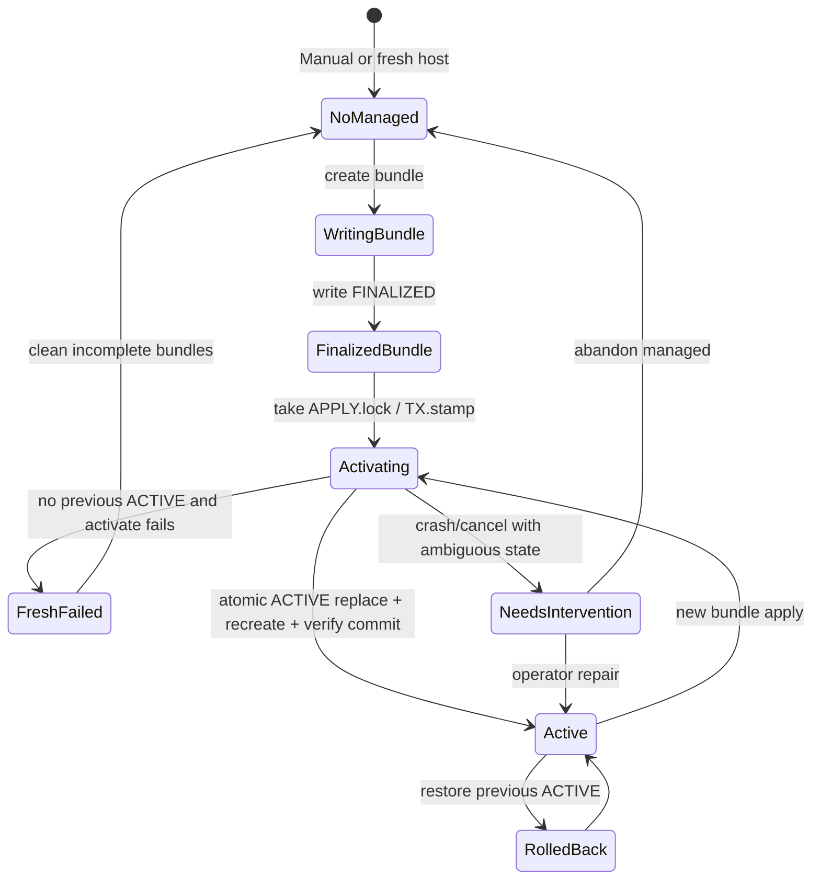

# ADR 0021: v1.2.0 Easy Setup の境界・設定契約・対応環境

- **Status:** Accepted
- **Date:** 2026-07-28
- **Tracks:** [#445](https://github.com/kooiei-in4a/amane-mailer/issues/445)（v1.2.0 Easy Setup tracking）
- **Design issue:** [#446](https://github.com/kooiei-in4a/amane-mailer/issues/446)
- **Preserves:** [ADR 0013](0013-admin-threat-model-and-pii-policy.md)（Admin 既定オフ・到達制限・PII）、[ADR 0014](0014-admin-session-tenant-throttle-audit-design.md)、[ADR 0019](0019-sqlite-single-process-boundaries.md)（SQLite／単一プロセス）、[ADR 0020](0020-bounce-ingestion-and-suppression.md)（mode 5 Queue は manual）
- **Implementation follow-up:** [#447](https://github.com/kooiei-in4a/amane-mailer/issues/447)–[#459](https://github.com/kooiei-in4a/amane-mailer/issues/459)（本 ADR merge まで実装着手禁止）
- **Release qualification ownership:** [#456](https://github.com/kooiei-in4a/amane-mailer/issues/456)（必須シナリオ表の Gate 列が Hard／Conditional／Informational の唯一の正本）

## Context

### 事業判断と v1.2.0 の位置づけ

v1.1.0 は「マニュアル中心 + read-only preflight / verification」を採用し、[setup-guide](../ops/setup-guide.md)、`setup doctor`、ACS 登録・検証 CLI を整備した。v1.2.0 は導入数を増やす事業判断に基づき、**既存の安全な CLI・設定契約を host 上の local Web / terminal assistant で包む**。Consumer 向け bounced Webhook [#307](https://github.com/kooiei-in4a/amane-mailer/issues/307) は v1.5.0 以降へ延期済みであり、v1.2.0 の主機能は Easy Setup とする（[#445](https://github.com/kooiei-in4a/amane-mailer/issues/445)）。

本 ADR は過去 Issue や既存 ADR の履歴を書き換えない。**維持する契約**と **v1.1.0 からの判断変更**を明示し、後続 Issue の Design authority とする。

### 現行契約（維持する正本）

| 領域 | 現行正本 | Easy Setup での扱い |
|------|----------|---------------------|
| tenant / token shape | `config/mailer/`、`tenants.json`、`token_env` | 同一 shape を生成・適用する。新 schema を作らない |
| deploy env | `infra/deploy/.env.example` | 同一キー空間。Managed では D-02 の分類に従い bundle へ格納または external に残す |
| Compose | `infra/deploy/compose.yml` | 既存サービス／mount／profile を維持。setup 専用サービスを追加しない |
| file secret | `ACS_CONNECTION_STRING_FILE`、bounce queue file secret 等 | 同一 mount 契約。secret を env 直書きや DB へ移さない |
| setup doctor | read-only PASS/FAIL/WARN/ACTION | 維持。Assistant 成功判定の補助に使えるが正本は effective + integrity |
| register-acs / test-acs-send | TTY CLI + exact 確認フレーズ | TTY adapter として維持。Web/terminal は typed operation 経由 |
| Admin | ADR 0013／0014、既定 `AMANE_ADMIN_ENABLED=false` | 任意 bootstrap（#459）。主セットアップ成功の必須条件にしない |
| mode 5 | bounce runbook + deploy compose | Easy Setup 自動対象外。manual 案内 |
| platform-sender.json | register-acs が書くが tenant ACS 送信経路では未使用（setup-guide） | send-ready 条件に含めない |

### 本 ADR で決めないこと（後続へ委譲）

- Setup Core／host adapter／Web／terminal の実装詳細（#447–#453）が **本 ADR の契約を満たす範囲での** API 名・ファイル名細部
- 配布 artifact の物理パッケージ形状（#455）
- release candidate 文書の最終文言（#457）
- 必須 E2E シナリオの個別手順と証拠フォーマット（#456）
- publish／tag／post-promote sync（#458）
- integrity seal／ephemeral verifier のバイトレイアウトや一時ファイルの正確な相対パス名（#447／#448 が D-04 の責任分担を満たす範囲で決定）

**本 ADR で決め切るもの（実装へ推測させない）:** activation の単一権威、env key 分類、metadata の read-only transport、integrity の host／container 責任分担と canonical 統合、verification record の commit／stale 意味論。

## Decision drivers

1. Manual Deployment を第一級のまま残し、Managed Setup を任意の加速経路にする。
2. 新しい runtime 設定形式・public HTTP contract・DB schema を増やさない。
3. secret／PII／provider raw error を UI・ログ・stdout／stderr・public result へ出さない。
4. Docker socket をコンテナへ渡さず、setup 専用コンテナを作らない。
5. Windows Docker Desktop と Linux Docker Engine／VPS で同一契約が成立する。
6. Admin の SQLite 副作用と config bundle rollback を混同しない。
7. 利用者環境の状態と release qualification evidence を混同しない。
8. activation authority を二重化せず、Compose が読む selector と pointer を一致させる。

## Trust boundaries

```text
[ Operator host ]
  Amane.Mailer setup assistant (same binary)
    ├─ Setup Core          … bundle / fingerprint / at-rest seal / apply orchestration
    ├─ Host Docker adapter … local docker / compose only; resolves ACTIVE → immutable bundle env
    ├─ localhost Web UI    … loopback only; no PTY driving of CLI
    └─ terminal UI         … interactive; shares Setup Core

[ Docker Engine (local) ]
  mailer container(s)      … normal runtime; no setup HTTP routes; no long-term sealing key
  one-shot inspect         … same image / env / mounts / config loader; ephemeral verifier only

[ Out of trust for Easy Setup protections ]
  Privileged host administrator who can rewrite seal + secrets together
  Compromised Docker Engine or host kernel
```

Easy Setup の主目的は **誤設定・取り違え・偶発変更・誤 mount** の検出である。特権 host 管理者による意図的改ざんは保護対象外とする。

## Decision

### D-01. 実行境界（Execution boundary）

| 契約 | 内容 |
|------|------|
| Host execution | `Amane.Mailer setup assistant` は **host 上**で実行する |
| UI | CLI ディスパッチ後に **localhost 限定 Web** または **terminal UI** を起動する |
| Runtime routes | 通常 Mailer runtime に setup HTTP route を map **しない** |
| Setup container | setup 専用 Docker コンテナを **作らない** |
| Docker socket | Docker socket をコンテナへ **渡さない** |
| Binary | 同じ `Amane.Mailer` 実行ファイルと共通 Setup Core を利用する |
| Remote Docker | Docker Context が remote の場合は操作せず **FAIL**（対象外） |

### D-02. 設定の正本と Managed／Manual 境界

#### Env / secret 分類（Managed 対象の全 key）

現行 `infra/deploy/.env.example` と file secret 契約を、次の 4 類に分ける。実装はキー表を #448 で列挙してよく、**分類契約は本 ADR が正本**とする。

| 分類 | 意味 | fingerprint | integrity / owner-only | Managed bundle 格納 | rollback |
|------|------|-------------|-------------------------|---------------------|----------|
| **public/non-secret configuration** | provider、`live_sending`、bounce mode／queue name、image tag、ports、resource limits、Admin enabled／username／local-address／allow-http／pii mode、path **bindings**（値は path）、metrics enabled 等 | **含める** | 改変検知は fingerprint／FINALIZED | `env/compose.env`（immutable） | ACTIVE 切替で戻る |
| **secret-valued environment** | `MAIL_SERVICE_TOKEN`、`MAIL_SERVICE_TOKEN_DEVELOP`／`_STAGING`／`_PRODUCTION`、`MAILER_METRICS_BEARER_TOKEN`、`AMANE_ADMIN_PASSWORD_HASH` | **含めない** | **integrity seal 対象**＋ owner-only（0600 相当） | `env/secrets.env`（immutable、host のみ読取可能な権限） | ACTIVE 切替で戻る |
| **file secret** | ACS connection string file、bounce queue connection string file 等 | **含めない** | **integrity seal 対象**＋ owner-only | `secrets/` | ACTIVE 切替で戻る |
| **external/manual-only operational** | `MAILER_DATA_PATH`（SQLite データ領域）、`MAILER_BACKUP_*`、rclone 設定、backup ping 等。Easy Setup が deployment 切替の一部として管理しない運用入力 | 含めない | Easy Setup integrity の対象外（運用 runbook） | **bundle に入れない** | config rollback 対象外 |

追加契約:

- secret-valued environment を `env/` の「non-secret 断片」と呼んではならない。`compose.env` と `secrets.env` を分離する。
- Managed 適用時、host adapter は **ACTIVE が指す bundle の immutable env のみ**を Compose に渡し、host 直下の旧 `.env` の secret-valued key と **マージして上書き競合させない**。競合検出時は FAIL。
- Manual 値が external に残り Managed が同一 key を要求する場合は fail-closed（下記競合規則）。
- `AMANE_ADMIN_PASSWORD_HASH` を Managed に含める場合でも、Admin bootstrap 成功条件・non-interactive 禁止（D-09／D-10）は別契約として優先する。

#### Ownership / source-of-truth

| 対象 | 正本 | Managed metadata の役割 | 送信・provider 判断 |
|------|------|-------------------------|---------------------|
| public/non-secret env | `compose.env`（Managed）または Manual `.env` | fingerprint 入力 | env／loader が正 |
| secret-valued env | `secrets.env`（Managed）または Manual `.env` | integrity 入力（値は出さない） | env／loader が正 |
| `tenants.json` | ファイル内容 | fingerprint 入力に non-secret 部分のみ | loader が正 |
| file secrets | ファイル内容 | integrity seal の入力（値は出さない） | file／loader が正 |
| Compose file | `infra/deploy/compose.yml`（または文書化された固定テンプレート） | image／compose bundle version を記録 | Compose + image tag が正 |
| Easy Setup metadata | active bundle の `recorded.json`（D-04 transport） | bundle 識別・照合・Assistant／Admin 表示 | **正本にしない** |
| verification record | Managed root 内（secret なし） | 直近照合結果の記録 | 送信判断に使わない |
| Admin DB (`admin_*`) | SQLite | bootstrap 結果の副作用 | config 正本ではない |
| external/manual-only | host 運用ファイル | 管理外 | 各 runbook |

#### Managed Setup vs Manual Deployment

| モード | 定義 | runtime 動作 |
|--------|------|--------------|
| **Managed Setup** | Managed root に finalize 済み bundle と有効な `ACTIVE` があり、Easy Setup が適用・照合する | host adapter が ACTIVE → immutable bundle env／mount を Compose に渡す。metadata は補助 |
| **Manual Deployment** | Managed root／`ACTIVE`／managed metadata が無い、または利用者が Easy Setup を使わない | **現行どおり動作**。`managed=false`。integrity を推測しない |

#### 競合時 fail-closed

次のいずれかを検出したら適用・成功判定を **FAIL** し、曖昧な「部分 Managed」を成功にしない。

1. `ACTIVE` が存在するのに、Compose に渡された env／mount が active bundle 外の tenants／secret／secret-valued env を指している。
2. active managed bundle 配下の immutable 対象ファイルが finalize 後に変更された（integrity mismatch）。
3. Manual 編集と Managed apply が同時進行し、lock を取れない／stamp が不一致。
4. 利用者が Managed 成功を主張しているのに recorded metadata または integrity 結果が `not-managed`／`not-verified`／`mismatch`。
5. Managed 適用時に host 側 Manual `.env` の secret-valued key が Compose 入力へ混入し、bundle `secrets.env` と競合する。

Manual Deployment では metadata が無くても既存 runtime を変更しない。Easy Setup が Manual 環境を自動 adopt しない。

### D-03. Immutable bundle と active deployment

#### Bundle 構成単位

Managed root（実装が文書化する固定相対レイアウト。概念名のみ本 ADR で固定）:

```text
<managed-root>/
  bundles/<bundle-id>/          # finalize 後 immutable
    config/                     # tenants.json 等（既存 shape）
    secrets/                    # file secrets（既存ファイル名契約）
    env/
      compose.env               # public/non-secret + path bindings（immutable）
      secrets.env               # secret-valued environment（immutable, owner-only）
    metadata/
      recorded.json             # bundleId, fingerprint, versions, mode, schema…（secret なし）
      integrity.seal            # opaque at-rest seal（host 権限。値を UI/log に出さない）
    FINALIZED                   # 存在して初めて activatable
  state/
    ACTIVE                      # 単一 activation authority（下記）
    APPLY.lock                  # apply 排他
    TX.stamp                    # 進行中 activationGeneration（任意だが推奨）
  verification/
    last-record.json            # verification record（secret なし）
  sealing/
    host-sealing-key            # 長期 host-local key（0600 相当。通常 runtime／永続 mount 禁止）
```

#### 単一 activation authority（mutable overlay 禁止）

**採用:** `ACTIVE` が **唯一の activation authority** である。

| 項目 | 契約 |
|------|------|
| `ACTIVE` ペイロード | `bundleId`、`activationGeneration`（単調増加）、`schemaVersion`。secret を含めない |
| Compose への入力 | host adapter が `ACTIVE.bundleId` を読み、**その bundle 内の immutable** `env/compose.env` と `env/secrets.env`、および path bindings が指す `config/`・`secrets/`・`metadata/recorded.json` だけを Compose に渡す |
| mutable overlay | `managed.active.env` のような **ACTIVE と別の mutable env ファイルを永続化しない**（split-brain 禁止） |
| path の実体 | path bindings の値は常に `bundles/<ACTIVE.bundleId>/...` 配下を指す |

これで selector は常に `ACTIVE` の 1 回の atomic replace に一致する。bundle 内 env は finalize 後不変のため、`ACTIVE` と path 内容の二重更新は発生しない。

#### Immutability

- finalize（`FINALIZED` 作成）後、bundle 配下の config／secrets／env／metadata／seal を上書きしない。
- 変更が必要なら **新しい bundle-id** を生成する。
- active location へ個別ファイルを逐次上書きする方式は採用しない。

#### Atomic 切替（symlink / reparse point 非採用）

**採用:** 同一ボリューム上の **一時ファイル書き込み + flush + atomic rename（置換）**。`ACTIVE` **のみ**を切り替える。

| OS | `ACTIVE` 更新 |
|----|----------------|
| Linux | `ACTIVE.tmp` 書き込み → file flush → `fsync` → `rename(2)` で `ACTIVE` を置換 → parent directory `fsync` |
| Windows | 同 volume で write → write-through／`FlushFileBuffers` 相当 → `MoveFileEx` / .NET `File.Replace` 相当で置換 |

**書込み順（固定）:**

1. 新 bundle の全ファイルを書き込み、各ファイルを flushする。
2. Linux では bundle ディレクトリを `fsync` する（Windows では volume flush 相当を行う）。
3. `FINALIZED` を書き込み flush／`fsync` する（これ以前の bundle は activatable でない）。
4. `TX.stamp`（または lock metadata）に新 `activationGeneration` を記録する。
5. `ACTIVE.tmp` に新 `bundleId` + `activationGeneration` を書き、flush／`fsync` する。
6. `ACTIVE.tmp` → `ACTIVE` を atomic replace する。parent directory を `fsync`（Linux）。
7. その後にのみコンテナ recreate／one-shot を行う。
8. verification record の commit は D-04（verification）に従う。

**fresh 作成:** 以前の `ACTIVE` が無い。手順 1–6 の途中失敗は FreshFailed。rollback 成功と表示しない。

**既存置換:** 旧 `ACTIVE` を previous として保持（実装は previous ファイルまたは世代ログでよい）。失敗時は previous `bundleId` へ `ACTIVE` を戻す。

**symlink / junction / reparse point を active pointer の主方式にしない。** 理由: Windows 権限差、Docker Desktop bind の fragile、攻撃面増加。検出した場合は追従せず FAIL／手動介入へ導く。Gate 分類上の扱いは [#456](https://github.com/kooiei-in4a/amane-mailer/issues/456) の必須シナリオ表に従う。

#### State model（適用ライフサイクル）



| 状況 | 契約 |
|------|------|
| **Fresh install failure** | 以前の `ACTIVE` が無い。失敗を rollback 成功と表示しない。不完全 bundle は activatable にしない |
| **Apply 中断 / cancel** | lock と TX.stamp を残し、再開または手動介入へ収束。成功と偽らない。verification record を成功扱いにしない |
| **Crash recovery** | 次回起動で lock／TX.stamp／不完全 ACTIVE／欠落 FINALIZED を検出。安全なら前 `ACTIVE` へ戻すか、介入を要求 |
| **Rollback** | 直前の成功 `ACTIVE`（previous）へ atomic replace し、コンテナを recreate し、fingerprint／integrity／verification を再確認。rollback 失敗を成功扱いしない。SQLite 副作用は戻さない（D-08） |
| **Stale bundle** | `ACTIVE` 外の旧 bundle は保持してよいが、起動対象にしない。保持世代数は実装 Issue で上限を決めてよい |
| **手動変更検知** | integrity mismatch または FINALIZED 後の内容変更検知で FAIL |

SQLite の migration／Admin 行／mail データは **bundle rollback の対象外**（D-08）。

### D-04. Metadata、fingerprint、integrity、verification record

| 概念 | 意味 | 公開してよいもの | 正本か |
|------|------|------------------|--------|
| **bundle ID** | 生成時に割り当てる不透明 ID | ID 文字列 | Managed 識別子。runtime 送信判断の正本ではない |
| **configuration fingerprint** | non-secret canonical configuration の同一性 | fingerprint 値 | non-secret 一致の証拠のみ |
| **bundle integrity** | secret を含む Managed bundle が改変されず、**期待どおり mount された**ことの確認 | **結果 enum のみ** | Managed 照合の必須。Manual では行わない |
| **recorded metadata** | Easy Setup が bundle に記録した read-only 記述 | secret を含まないフィールド | runtime 設定の正本ではない |
| **effective configuration** | recreate 後コンテナ内で runtime と同じ loader が解決した non-secret 実効値 | non-secret 実効値 | 実効観測。recorded と別責任 |
| **verification record** | 直近照合の記録（時刻、bundleId、activationGeneration、fingerprint 比較、integrity enum、image／compose version…） | secret なし | 履歴。release evidence ではない |
| **image／compose bundle version** | 使用イメージ tag／digest 参照方針と compose テンプレート版 | バージョン識別子 | 実行物の識別。fingerprint 入力に含めてよい |
| **stale／mismatch／not-managed／not-verified** | 照合結果の canonical 分類 | enum／理由コード | 成功判定に使用 |

#### Fingerprint 契約

- **public/non-secret configuration のみ**を canonical 化する。
- secret-valued environment、file secret、token、接続文字列、password、password hash、HMAC、salt は **含めない**。
- **fingerprint 一致だけを「bundle 全体一致」と表現しない。**

#### Integrity: host at-rest と container mount の分担（固定）

長期 sealing key + HMAC を採用するが、**検証経路を次のように固定する**（one-shot に長期 key を渡さない）。

| # | 責任 | 誰が | 入力 | 出力 |
|---|------|------|------|------|
| 1 | **Host at-rest seal 検証** | Setup Core（host） | `integrity.seal` + 長期 `host-sealing-key` + host 上の期待 bundle ファイル | 内部結果 `hostAtRest` = matched／mismatch／not-verified |
| 2 | **Container actual-mounted-secret 検証** | recreate 後 one-shot（container） | **実際に mount された** secret-valued env／file secret + **ephemeral verifier**（下記） | 内部結果 `mountAttestation` = matched／mismatch／not-verified |
| 3 | **Canonical 統合** | Setup Core（host）が one-shot の enum だけを受け取り統合 | `hostAtRest` × `mountAttestation` | 公開 `bundleIntegrity` enum |

**Canonical 統合規則（fail-closed）:**

| hostAtRest | mountAttestation | bundleIntegrity |
|------------|------------------|-----------------|
| matched | matched | `matched` |
| いずれかが mismatch | （任意） | `mismatch` |
| Manual／非 Managed | — | `not-managed` |
| seal／verifier 欠落・破損・期限切れ | （任意） | `not-verified` |
| matched | not-verified | `not-verified` |

host 上の期待ファイルだけを HMAC しても **コンテナへ別 secret が mount された証明にはならない**。よって Managed 成功には **両方 matched** を必須とする。

##### Ephemeral verifier（one-shot 向け一時方式）

1. host が inspect ごとに `sessionNonce` と ephemeral `sessionKey` を生成する（長期 sealing key から導出してもよいが、**sessionKey 自体をコンテナ外へ再利用可能な形で残さない**）。
2. host は期待 secret bytes（active bundle 上）について `HMAC(sessionKey, path || bytes)` を計算し、one-shot へ **その期待 MAC と sessionKey／nonce／bundleId／path 一覧**だけを渡す。
3. 受け渡しは **単回の one-shot 起動に限定**する（stdin、短命な 0600 一時ファイル、または同等）。**通常 runtime の永続 env／永続 mount／通常 Compose env には入れない**。
4. one-shot は **実際に mount された** bytes で同じ HMAC を再計算し、期待 MAC と比較する。結果は enum のみ返す。
5. host は one-shot 終了直後に一時 verifier を削除する。失敗時も削除を試み、残存を検出したら `not-verified`／FAIL。
6. **禁止:** 長期 sealing key を通常 runtime や永続 mount へ渡すこと。verifier／HMAC／salt／sessionKey を CLI args、通常 env、stdout、stderr、log、verification record、Admin、永続ファイルへ残すこと。

##### 方式比較

| 方式 | 評価 |
|------|------|
| **A. Host at-rest seal + ephemeral mount attestation（採用）** | 誤 mount を証明できる。長期 key を runtime に置かない |
| B. 長期 sealing key を one-shot へ mount | **却下** — 通常と同型の environment に長期秘密が混入する |
| C. Secret 平文 SHA を metadata に保存 | **却下** — 再利用可能な secret 由来情報 |
| D. host のみ HMAC（container 検証なし） | **却下** — 実 mount を証明できない |
| E. OS ACL／mtime のみ | **却下** — 差し替え検出が弱い |

**残存リスク:** 特権者が seal・secret・ACTIVE を同時改ざんすれば偽装可能（保護対象外）。ephemeral verifier 実装バグは #456 のシナリオで検出する。

#### Runtime-visible metadata transport（固定）

| 項目 | 契約 |
|------|------|
| Host 側ファイル | `bundles/<bundle-id>/metadata/recorded.json`（secret なし） |
| Container 固定 path | `/run/amane/setup/recorded.json` |
| Mount | ACTIVE が選ぶ bundle の `recorded.json` を上記 path へ **:ro** bind。path binding は immutable `compose.env` に含める |
| Discovery env | `MAILER_SETUP_RECORDED_METADATA_PATH=/run/amane/setup/recorded.json`（任意だが推奨）。値は path のみ |
| 通常 runtime | 同一 image／同一 mount／同一 env で read-only 読取。送信判断に使わない |
| one-shot | 通常 runtime と **同じ** metadata mount を読む |
| Admin（#454） | 認証済み runtime 内の読取（同一 loader）。host Managed root を Admin から直接開けない前提でよい |
| Manual | ファイル不在または path 未設定 → `managed=false`。通常配送を失敗させない |
| 一致検証 | `recorded.bundleId` が `ACTIVE.bundleId` と一致し、mount 元が active bundle 配下であること。不一致は `mismatch`／`stale` |

Compose 本体 YAML に setup 専用サービスは追加しない。Managed 時の bind 追加は **既存 mailer サービスへの read-only mount／env** として host adapter が immutable `compose.env`／compose override の文書化された固定テンプレートで行う（任意 path 注入 UI は禁止）。

#### Verification record: commit 順序と stale（固定）

| 時点 | 契約 |
|------|------|
| activation 開始（APPLY.lock／TX.stamp） | 旧 `last-record.json` を **現行成功記録として扱わない**。削除、または `status=invalidated` + 新 `activationGeneration` の pending stamp へ atomic 置換する |
| recreate／effective inspection／integrity（host+mount）／readiness の **全成功後のみ** | 新 record を `last-record.json.tmp` → atomic replace で commit する |
| record 必須フィールド | `bundleId`、`activationGeneration`、fingerprint 比較結果、`bundleIntegrity` enum、image／compose version、schemaVersion、committedAt |
| record commit 失敗 | Managed apply を **成功にしない**（FAIL または NeedsIntervention）。send-ready を表示しない |

**stale / mismatch 判定（Admin／Assistant 共通）:**

- `record.bundleId != ACTIVE.bundleId` → stale
- `record.activationGeneration != ACTIVE.activationGeneration` → stale
- image digest／compose version／fingerprint／schema が ACTIVE／recorded と不一致 → stale または mismatch（理由コードで区別）
- APPLY.lock 保持中／TX.stamp が未完了 → verification pending（send-ready にしない）

**Admin 表示:**

- activation 中・rollback 中・crash recovery 中は send-ready と表示しない（pending／unknown／ACTION）。
- **record 単独から send-ready を推測しない。** send-ready は D-07 の条件（effective／doctor／readiness／fingerprint／integrity 一致等）を満たした場合のみ。
- deployment operational verification を確認済みと表示しない（D-07）。

### D-05. Effective inspection

| 契約 | 内容 |
|------|------|
| Not memory introspection | 稼働中 process のメモリを覗かない |
| Execution | apply／recreate **後**の Mailer コンテナ（または同一 Compose 定義の one-shot）内で実行する |
| Sameness | runtime と **同じ image、environment、mount、configuration loader** を使う（ただし ephemeral verifier は inspect 起動にのみ付与し、通常 runtime には付与しない） |
| Result shape | `recorded metadata`、`effective configuration`（non-secret）、`bundle integrity`（canonical enum）を **別フィールド**で返す |
| Secrets | 結果に secret／HMAC／salt／sessionKey を含めない |
| Integrity 算出 | D-04 の mount attestation を one-shot が行い、host が at-rest と統合する |

コマンド名（例: `setup inspect-effective`）の正確な CLI 面は #447 が本契約の下で決定する。

### D-06. Web／terminal／CLI 責任分担

| コンポーネント | 責任 | 禁止 |
|----------------|------|------|
| **Setup Core** | bundle 生成、fingerprint、at-rest seal、canonical integrity 統合、apply オーケストレーション、verification commit、状態機械 | UI フレームワーク依存、任意 shell 文字列実行、mutable overlay 永続化 |
| **Host adapter** | ローカル Docker／Compose の固定操作、`ACTIVE` → immutable bundle env 解決、preflight、remote context 拒否、ephemeral verifier の単回受け渡しと削除 | 利用者任意の docker 引数／path／compose ファイル注入、長期 sealing key のコンテナ永続化 |
| **localhost Web adapter** | loopback UI、入力収集、Core 呼び出し | **interactive CLI subprocess／PTY の自動操作**、任意コマンド実行 |
| **terminal adapter** | headless／VPS 向け対話 UI、Core 呼び出し | Web 専用前提の省略による契約緩和 |
| **既存 TTY CLI** | `register-acs` / `test-acs-send` 等の人間向け adapter | Web からの PTY ラップ対象にしない |
| **typed ACS Application Service** | console 非依存の登録・Staging 検証・確認フレーズ境界 | secret を CLI 引数・URL・ログへ渡すこと |
| **runtime** | 通常配送・既存 Admin。setup route なし。recorded metadata の read-only 読取可 | Managed metadata を送信正本化、長期 sealing key／ephemeral verifier の常駐 |
| **Admin** | 認証済み read-only setup status（#454）、任意 bootstrap（#459） | doctor 実行・テスト送信・Docker 操作・独自 apply ロジック |

Web／terminal／TTY は **同じ typed ACS operation** を呼ぶ。Production 向け `live_sending=false` 迂回テストは作らない。

### D-07. Deployment state と Release qualification

次を混同しない。

| 状態 | 意味 | Assistant／Admin 表示 | release evidence |
|------|------|------------------------|------------------|
| **Deployment configuration applied** | 利用者環境へ設定 bundle が適用された（`ACTIVE` commit 済み） | 表示可。verification 未 commit なら未検証と併記 | 利用者ローカル記録。製品 release 証拠ではない |
| **Deployment send-ready** | `live_sending=true`（該当 mode）等を含む bundle が適用され、effective／doctor／readiness／fingerprint／integrity が一致し、verification record が現行 ACTIVE と一致 | 通常完了の上限 | 利用者ローカル。release 証拠ではない |
| **Deployment operational verification** | 利用者環境から通常 Mailer 経路で実送信確認した | **v1.2.0 Easy Setup では自動記録しない**。「記録していない。Manual verification が必要」と表示 | 作らない |
| **Release Production operational verification** | maintainer 管理環境で RC が通常 Mailer 経路の Production 送信を完遂 | 利用者 UI に流用しない | **#456／#458 の release evidence** |

#454 は利用者環境の send-ready までを表示し、deployment operational verification を確認済みと表示しない。release qualification を各利用者環境の verification として保存・表示しない。

### D-08. Admin 境界（実装所有は #459）

- Admin bootstrap は **主セットアップ完了後の任意 transaction**。
- DB 事前分類:
  - `fresh`: `admin_config` なし、`admin_users` 0 件
  - `managed-same-user`: Easy Setup 管理下で同一 username を再適用
  - `existing-manual-or-unsupported`: Manual 既存、異なる username、複数 Admin、rotation 要求など
- v1.2.0 対象は **fresh** と **managed-same-user idempotent reapply** のみ。それ以外は Manual 経路へ案内。
- **config bundle rollback と SQLite（`admin_config`／`admin_users`／session revoke／credential epoch）の rollback を同一視しない。**
- Admin 有効化後に後続検証が失敗した場合、DB 変更が残り得る。canonical result と ACTION で示し、config を disabled に戻しても DB 行は残り得る。Admin disabled 時は route 未登録により外部利用されない（ADR 0013 D-01）。
- 部分成功・再実行・手動介入状態を Core の結果モデルで表現する（詳細は #459）。

### D-09. Admin access profile

Admin 有効化フラグだけで完了としない。到達経路を profile とする。

#### Local Development profile

- 用途: local Mailpit／Docker Desktop／local rehearsal
- 条件:
  - `ASPNETCORE_ENVIRONMENT=Development`
  - loopback port だけを host へ公開
  - `AMANE_ADMIN_ALLOW_HTTP=true`
  - localhost からアクセス
  - `Connection.LocalIpAddress` が Admin local-address policy（`AMANE_ADMIN_ALLOWED_LOCAL_ADDRESS`）を満たす

#### Production HTTPS profile

- 用途: Staging／Production
- 条件:
  - 承認済み HTTPS reverse proxy または同等の経路が **既に存在**
  - `AMANE_ADMIN_ALLOW_HTTP=false`
  - Secure cookie／`__Host-` cookie が成立
  - proxy 経路で `Connection.LocalIpAddress` を確認できる
  - `AMANE_ADMIN_ALLOWED_LOCAL_ADDRESS` が実際の server-side local address と一致
  - Admin を公開 Internet へ直接露出しない

追加契約:

- Easy Setup は reverse proxy、証明書、DNS を **自動構築しない**。
- access profile 不成立時は Admin bootstrap を提示しない、または Admin だけ FAIL とし **disabled を維持**する。
- access profile 不成立で主 Mailpit／ACS セットアップを FAIL に **しない**。
- Admin bootstrap 成功 = bundle 適用・credential sync に加え、選択 profile で **login と `/admin/setup-status` 表示が成功**したこと。
- allowed local address はクライアント送信元 IP ではなく **`Connection.LocalIpAddress`** に対する条件（ADR 0013 D-03 と一致）。
- Production で HTTP 緩和（`AMANE_ADMIN_ALLOW_HTTP=true`）を許可しない。

### D-10. Non-interactive 境界

```text
setup apply --non-interactive
  → Main setup のみ
  → Admin disabled
```

- Admin bootstrap は対話式 Web または対話式 terminal からのみ。
- non-interactive 入力で Admin enabled、password、password hash、password hash file を受け付けない。
- Admin 有効化要求があれば黙って無視せず **FAIL** し、対話式 Assistant へ案内する。
- 平文 password を file、redirected stdin、CLI argument から受け取らない。
- password hash file 方式は v1.2.0 対象外。

### D-11. 対応範囲（Support matrix）

本表は **製品サポート分類**である。Hard／Conditional／Informational の Gate 分類は記載せず、現行分類はすべて [#456](https://github.com/kooiei-in4a/amane-mailer/issues/456) の必須シナリオ表を参照する。

| 対象 | サポート分類 |
|------|----------------|
| mode 1–4 | Easy Setup **正式対象** |
| mode 5（production ACS + Queue） | Easy Setup 自動化 **対象外**（既存 manual runbook へ案内） |
| Windows Docker Desktop | **正式対象** |
| Linux Docker Engine | **正式対象** |
| VPS（上記 Engine） | **正式対象** |
| NAS | **best-effort** |
| remote Docker | **対象外**（操作せず FAIL） |
| macOS 配布保証 | **対象外** |
| Kubernetes／Podman | **対象外** |
| setup と upgrade | **別操作**。本 ADR の Easy Setup は setup |

### D-12. Release gate

- Hard／Conditional／Informational の定義:

| Gate | 意味 |
|------|------|
| **Hard** | 未実施または FAIL は No-Go。代替確認だけでは PASS にできない |
| **Conditional** | 事前定義条件、実行不能理由、代替確認、residual risk、承認者、影響範囲を記録した場合のみ Go 判断可 |
| **Informational** | 未実施でも release を止めない |

- **必須シナリオ表の Gate 列の唯一の正本は [#456](https://github.com/kooiei-in4a/amane-mailer/issues/456) である。** 本 ADR に個別シナリオの Gate 分類を再記載・複製しない。
- Gate 分類の変更は qualification 中の都合では行わず、本 ADR の amendment または明示的な計画変更で行う。
- Status UI（#454）は観測表示であり、Operations（Docker／ACS／bootstrap）の実行面ではない。

### D-13. Implementation status lifecycle

| 項目 | 契約 |
|------|------|
| feature ID | `easy-setup` |
| Design authority | 本 ADR（#446） |
| tracking Issue | [#445](https://github.com/kooiei-in4a/amane-mailer/issues/445) |
| #446 | `planned` entry 追加 |
| 最初の実装 PR | `partial` |
| #447–#455／#459 | evidence 更新 |
| #458 | 全ゲート確認後に `implemented` |

現在の実装状況の正本は常に [implementation-status.json](../implementation-status.json) とする。本 ADR に日付付き実装ステータス表を置かない。

### D-14. Design-change gate

実装中に次を変更したくなった場合、子 Issue／PR 内で決定しない。実装を停止し、**ADR amendment Issue + 独立レビュー**を経る。

- 新しい runtime 設定形式
- setup 用コンテナ
- Docker socket mount
- Production test bypass（`live_sending=false` 迂回）
- Status UI の別公開（未認証／別ポート常時公開など）
- mode 5 自動化
- remote Docker 対応
- secret の DB 保存
- credential rotation（本 ADR 対象外のまま）
- public HTTP setup endpoint
- Easy Setup による reverse proxy 自動構築
- non-interactive Admin bootstrap
- active pointer の主方式としての symlink／reparse point
- **ACTIVE と別の mutable overlay env を第二の activation authority にすること**
- 長期 sealing key の通常 runtime 常駐、または container 検証なしの host-only integrity
- fingerprint 一致のみでの bundle 全体一致宣言
- #456 必須シナリオ表以外への Hard gate 二重管理

### D-15. v1.2.0 に入れない機能（非目標の固定）

- Setup Core／UI／Docker 操作以外に、credential／password rotation、mode 5 自動化、reverse proxy／証明書／DNS 自動構築、non-interactive Admin bootstrap、password hash file、deployment operational verification 記録機能、Consumer bounced Webhook #307、既存 Manual の自動 adopt、通常 Admin からの doctor／テスト送信／Docker 操作、Kubernetes／Podman／remote Docker、全 NAS 正式対応、macOS 配布保証。

## Alternatives considered

| 案 | 内容 |
|----|------|
| Runtime-embedded setup routes | Mailer に `/setup` を追加しブラウザから構成 |
| Setup sidecar container + docker.sock | 専用コンテナが Engine を操作 |
| Symlink-based active pointer | `current` → `bundles/<id>` |
| Dual ACTIVE + mutable overlay env | pointer と Compose env を別々に atomic rename |
| New runtime config format | YAML／DB 設定へ移行 |
| Metadata as send authority | fingerprint／metadata で `live_sending` を上書き |
| Host-only HMAC integrity | host 期待ファイルだけ検証し mount は見ない |
| Long-term key in one-shot mount | sealing key を inspect／runtime へ常駐 |
| Web drives TTY via PTY | 既存 CLI を自動操作 |
| Single “verified” flag | send-ready と release qualification を同一フラグに |

## Rejected alternatives

| 案 | 却下理由 |
|----|----------|
| Runtime setup routes | 攻撃面拡大、Admin 以外の到達点、ADR 0013 と矛盾しやすい |
| Setup container + docker.sock | socket 委譲はホスト支配と等価。禁止契約に抵触 |
| Symlink／reparse active | Windows 権限差・Docker bind の fragile・攻撃面増加 |
| Dual ACTIVE + mutable overlay | 組として非 atomic。split-brain で単一 pointer 契約が崩れる |
| New runtime config format | Manual 互換破壊、Contracts／docs／ops 全面書き換え |
| Metadata as send authority | 二重正本。loader と乖離した送信判断が生まれる |
| Host-only HMAC | 実コンテナへの誤 mount を証明できない |
| Long-term key in container | 通常 runtime と同型 environment への秘密混入 |
| Web→PTY CLI | secret 漏洩、非決定的、TTY 確認フレーズの自動化が危険 |
| 平文 secret hash の永続化 | 再利用可能な secret 由来情報 |
| non-interactive Admin bootstrap | 平文／hash file／stdin の秘密取り扱いが崩れる |
| Hard gate 一覧の ADR 複製 | #456 と二重管理になり qualification が漂流する |

## Consequences

- _positive:_ 後続 #447–#459 が同一の実行境界・正本・fail-closed・Admin／non-interactive 契約で実装できる。
- _positive:_ Manual Deployment と既存 doctor／ACS CLI／compose／file secret 契約が維持される。
- _positive:_ 単一 `ACTIVE` authority により Compose selector の split-brain を設計上排除する。
- _positive:_ host at-rest と container mount attestation の分担で誤 mount 検出経路が成立する。
- _positive:_ fingerprint と integrity の分離、および secret 非露出が Design authority として固定される。
- _positive:_ 利用者 send-ready と release Production operational verification が分離され、誤った「本番検証済み」表示を防げる。
- _negative:_ ephemeral verifier の単回受け渡し・削除と、verification record commit 失敗時の FAIL 扱いが増える（#447／#450／#456）。
- _negative:_ Admin DB 副作用が残り得るため、部分成功の UX／文書が必要（#459／#457）。
- _negative:_ secret-valued env を bundle 内 owner-only ファイルとして扱う運用・権限設計が増える。
- _operational:_ sealing key と Managed root の権限（owner-only）を runbook で明示する（#457）。
- _operational:_ backup は引き続き DB に加え tenants／env／secret／Managed root の運用バックアップが必要（既存 backup runbook を拡張するなら #457）。

## Residual risks

1. 特権 host 改ざんは検知目標外（D-04）。
2. NAS／特殊 FS での atomic rename／fsync 意味論の差（サポート分類は best-effort。Gate 扱いは #456）。
3. compose 外の手動 `docker run` との混在は fail-closed でも運用者が混乱しうる。
4. platform-sender 未使用ギャップは v1.1.0 から継続（send-ready に含めない）。
5. integrity／ephemeral verifier 実装バグは #456 の必須シナリオで潰す前提。

## Follow-up Issue ownership

| Issue | 所有 |
|-------|------|
| #447 | effective inspection、ephemeral mount attestation の one-shot 面 |
| #448 | Setup Core／immutable bundle／fingerprint／at-rest seal／env 分類のキー表 |
| #449 | host Docker adapter／ACTIVE 解決／preflight |
| #450 | apply／verify／rollback／crash 収束／verification record commit |
| #451 | typed ACS workflow 統合 |
| #452 | localhost Web Assistant |
| #453 | terminal fallback |
| #454 | Admin read-only setup status（record stale 表示含む） |
| #455 | 配布 bundle |
| #456 | E2E／security／Gate 正本の実行と go／no-go |
| #457 | 単一入口 docs（Manual／Hardened 維持） |
| #458 | version／publish／`implemented` 更新 |
| #459 | Admin 任意 bootstrap |

## English decision summary（JA 本文との意味整合用）

This ADR accepts host-side Easy Setup that wraps existing `.env` / `tenants.json` / file-secret / deploy compose contracts. Metadata is not a runtime authority. Managed deployments use immutable bundles; the sole activation authority is `ACTIVE` (bundleId + activationGeneration). Host adapters resolve `ACTIVE` to immutable per-bundle `compose.env` / `secrets.env` — no separate mutable overlay. Env keys are classified as public/non-secret, secret-valued environment, file secret, or external/manual-only. Configuration fingerprint covers non-secret only; integrity combines host at-rest seal verification with container mount attestation via an ephemeral verifier (long-term sealing key never enters normal runtime). Recorded metadata is mounted read-only at `/run/amane/setup/recorded.json`. Verification records commit only after recreate + inspection + integrity + readiness succeed, and are stale when they disagree with `ACTIVE`. Effective inspection is a same-image one-shot after recreate. Web/terminal call typed ACS operations and must not drive TTY/PTY CLIs. Admin bootstrap is optional (#459). Modes 1–4 are in scope; mode 5 stays manual. Gate classifications live only in issue #456. Feature id `easy-setup` is `planned` here and becomes `implemented` only after #458.

## 実装ステータス

本 ADR は方針・契約・非目標を定める。**現在の実装状況は [実装ステータスマニフェスト](../implementation-status.json) を正本とする。**

## References

- [#445](https://github.com/kooiei-in4a/amane-mailer/issues/445) v1.2.0 Easy Setup tracking
- [#446](https://github.com/kooiei-in4a/amane-mailer/issues/446) Design authority issue
- [#456](https://github.com/kooiei-in4a/amane-mailer/issues/456) Release qualification／Gate 正本
- [#447](https://github.com/kooiei-in4a/amane-mailer/issues/447)–[#459](https://github.com/kooiei-in4a/amane-mailer/issues/459) Implementation follow-ups
- [setup-guide](../ops/setup-guide.md)／[setup-guide.en.md](../ops/setup-guide.en.md)
- [ADR 0013](0013-admin-threat-model-and-pii-policy.md)
- [ADR 0014](0014-admin-session-tenant-throttle-audit-design.md)
- [ADR 0019](0019-sqlite-single-process-boundaries.md)
- [ADR 0020](0020-bounce-ingestion-and-suppression.md)
- `infra/deploy/compose.yml`
- `infra/deploy/.env.example`
