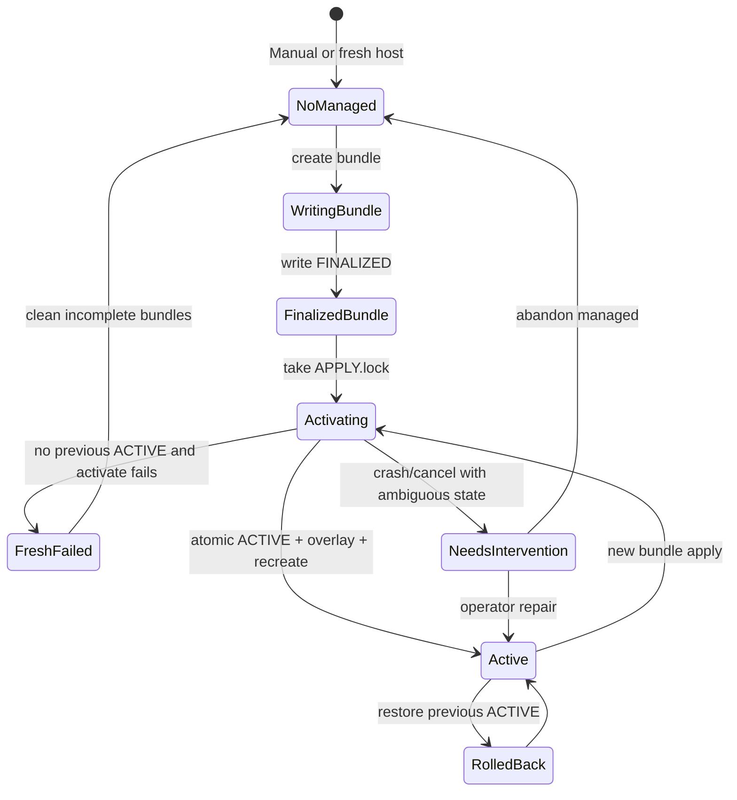

# ADR 0021: v1.2.0 Easy Setup の境界・設定契約・対応環境

- **Status:** Accepted
- **Date:** 2026-07-28
- **Tracks:** [#445](https://github.com/kooiei-in4a/amane-mailer/issues/445)（v1.2.0 Easy Setup tracking）
- **Design issue:** [#446](https://github.com/kooiei-in4a/amane-mailer/issues/446)
- **Preserves:** [ADR 0013](0013-admin-threat-model-and-pii-policy.md)（Admin 既定オフ・到達制限・PII）、[ADR 0014](0014-admin-session-tenant-throttle-audit-design.md)、[ADR 0019](0019-sqlite-single-process-boundaries.md)（SQLite／単一プロセス）、[ADR 0020](0020-bounce-ingestion-and-suppression.md)（mode 5 Queue は manual）
- **Implementation follow-up:** [#447](https://github.com/kooiei-in4a/amane-mailer/issues/447)–[#459](https://github.com/kooiei-in4a/amane-mailer/issues/459)（本 ADR merge まで実装着手禁止）
- **Release qualification ownership:** [#456](https://github.com/kooiei-in4a/amane-mailer/issues/456)（必須シナリオ表の Gate 列が Hard／Conditional／Informational の唯一の正本）

## Context

### 事業判断と v1.2.0 の位置づけ

v1.1.0 は「マニュアル中心 + read-only preflight / verification」を採用し、[setup-guide](../ops/setup-guide.md)、`setup doctor`、ACS 登録・検証 CLI を整備した。v1.2.0 は導入数を増やす事業判断に基づき、**既存の安全な CLI・設定契約を host 上の local Web / terminal assistant で包む**。Consumer 向け bounced Webhook [#307](https://github.com/kooiei-in4a/amane-mailer/issues/307) は v1.5.0 以降へ延期済みであり、v1.2.0 の主機能は Easy Setup とする（[#445](https://github.com/kooiei-in4a/amane-mailer/issues/445)）。

本 ADR は過去 Issue や既存 ADR の履歴を書き換えない。**維持する契約**と **v1.1.0 からの判断変更**を明示し、後続 Issue の Design authority とする。

### 現行契約（維持する正本）

| 領域 | 現行正本 | Easy Setup での扱い |
|------|----------|---------------------|
| tenant / token shape | `config/mailer/`、`tenants.json`、`token_env` | 同一 shape を生成・適用する。新 schema を作らない |
| deploy env | `infra/deploy/.env.example` | 同一キー空間。Managed は path 解決を bundle へ向ける |
| Compose | `infra/deploy/compose.yml` | 既存サービス／mount／profile を維持。setup 専用サービスを追加しない |
| file secret | `ACS_CONNECTION_STRING_FILE`、bounce queue file secret 等 | 同一 mount 契約。secret を env 直書きや DB へ移さない |
| setup doctor | read-only PASS/FAIL/WARN/ACTION | 維持。Assistant 成功判定の補助に使えるが正本は effective + integrity |
| register-acs / test-acs-send | TTY CLI + exact 確認フレーズ | TTY adapter として維持。Web/terminal は typed operation 経由 |
| Admin | ADR 0013／0014、既定 `AMANE_ADMIN_ENABLED=false` | 任意 bootstrap（#459）。主セットアップ成功の必須条件にしない |
| mode 5 | bounce runbook + deploy compose | Easy Setup 自動対象外。manual 案内 |
| platform-sender.json | register-acs が書くが tenant ACS 送信経路では未使用（setup-guide） | send-ready 条件に含めない |

### 本 ADR で決めないこと（後続へ委譲）

- Setup Core／host adapter／Web／terminal の実装詳細（#447–#453）
- 配布 artifact の物理パッケージ形状（#455）
- release candidate 文書の最終文言（#457）
- 必須 E2E シナリオの個別手順と証拠フォーマット（#456）
- publish／tag／post-promote sync（#458）
- integrity seal のバイトレイアウトや鍵ファイルの正確な相対パス名（#448 が本 ADR の契約を満たす範囲で決定）

## Decision drivers

1. Manual Deployment を第一級のまま残し、Managed Setup を任意の加速経路にする。
2. 新しい runtime 設定形式・public HTTP contract・DB schema を増やさない。
3. secret／PII／provider raw error を UI・ログ・stdout／stderr・public result へ出さない。
4. Docker socket をコンテナへ渡さず、setup 専用コンテナを作らない。
5. Windows Docker Desktop と Linux Docker Engine／VPS で同一契約が成立する。
6. Admin の SQLite 副作用と config bundle rollback を混同しない。
7. 利用者環境の状態と release qualification evidence を混同しない。

## Trust boundaries

```text
[ Operator host ]
  Amane.Mailer setup assistant (same binary)
    ├─ Setup Core          … bundle / fingerprint / integrity / apply orchestration
    ├─ Host Docker adapter … local docker / compose only (no remote context)
    ├─ localhost Web UI    … loopback only; no PTY driving of CLI
    └─ terminal UI         … interactive; shares Setup Core

[ Docker Engine (local) ]
  mailer container(s)      … normal runtime; no setup HTTP routes
  one-shot inspect         … same image / env / mounts / config loader

[ Out of trust for Easy Setup protections ]
  Privileged host administrator who can rewrite seal + secrets together
  Compromised Docker Engine or host kernel
```

Easy Setup の主目的は **誤設定・取り違え・偶発変更・誤 mount** の検出である。特権 host 管理者による意図的改ざんは保護対象外とする。

## Decision

### D-01. 実行境界（Execution boundary）

| 契約 | 内容 |
|------|------|
| Host execution | `Amane.Mailer setup assistant` は **host 上**で実行する |
| UI | CLI ディスパッチ後に **localhost 限定 Web** または **terminal UI** を起動する |
| Runtime routes | 通常 Mailer runtime に setup HTTP route を map **しない** |
| Setup container | setup 専用 Docker コンテナを **作らない** |
| Docker socket | Docker socket をコンテナへ **渡さない** |
| Binary | 同じ `Amane.Mailer` 実行ファイルと共通 Setup Core を利用する |
| Remote Docker | Docker Context が remote の場合は操作せず **FAIL**（対象外） |

### D-02. 設定の正本と Managed／Manual 境界

#### Ownership / source-of-truth

| 対象 | 正本 | Managed metadata の役割 | 送信・provider 判断 |
|------|------|-------------------------|---------------------|
| `.env` / deploy env keys | 既存 env 契約 | path を active bundle へ向ける記録可 | env／loader が正 |
| `tenants.json` | ファイル内容 | fingerprint 入力に non-secret 部分のみ | loader が正 |
| file secrets | ファイル内容 | integrity seal の入力（値は出さない） | file／loader が正 |
| Compose file | `infra/deploy/compose.yml`（または文書化された固定テンプレート） | image／compose bundle version を記録 | Compose + image tag が正 |
| Easy Setup metadata | Managed root 内の recorded metadata | bundle 識別・照合・Assistant／Admin 表示 | **正本にしない** |
| verification record | Managed root 内（secret なし） | 直近照合結果の記録 | 送信判断に使わない |
| Admin DB (`admin_*`) | SQLite | bootstrap 結果の副作用 | config 正本ではない |

#### Managed Setup vs Manual Deployment

| モード | 定義 | runtime 動作 |
|--------|------|--------------|
| **Managed Setup** | Managed root に finalize 済み bundle と有効な `ACTIVE` pointer があり、Easy Setup が適用・照合する | 既存 loader で active bundle のファイルを読む。metadata は補助 |
| **Manual Deployment** | Managed root／`ACTIVE`／managed metadata が無い、または利用者が Easy Setup を使わない | **現行どおり動作**。`managed=false`。integrity を推測しない |

#### 競合時 fail-closed

次のいずれかを検出したら適用・成功判定を **FAIL** し、曖昧な「部分 Managed」を成功にしない。

1. `ACTIVE` が存在するのに、Compose／overlay が active bundle 外の tenants／secret path を指している。
2. active managed bundle 配下の immutable 対象ファイルが finalize 後に変更された（integrity mismatch）。
3. Manual 編集と Managed apply が同時進行し、lock を取れない／stamp が不一致。
4. 利用者が Managed 成功を主張しているのに recorded metadata または integrity 結果が `not-managed`／`not-verified`／`mismatch`。

Manual Deployment では metadata が無くても既存 runtime を変更しない。Easy Setup が Manual 環境を自動 adopt しない。

### D-03. Immutable bundle と active deployment

#### Bundle 構成単位

Managed root（実装が文書化する固定相対レイアウト。概念名のみ本 ADR で固定）:

```text
<managed-root>/
  bundles/<bundle-id>/          # finalize 後 immutable
    config/                     # tenants.json 等（既存 shape）
    secrets/                    # file secrets（既存ファイル名契約）
    env/                        # compose が参照する path 解決に必要な non-secret 断片
    metadata/
      recorded.json             # bundleId, fingerprint, versions, mode, schema…（secret なし）
      integrity.seal            # opaque seal（host 権限で保護。値を UI/log に出さない）
    FINALIZED                   # 存在して初めて activatable
  state/
    ACTIVE                      # 単一 active deployment pointer（bundle-id）
    APPLY.lock                  # apply 排他
  verification/
    last-record.json            # verification record（secret なし）
  sealing/
    host-sealing-key            # host-local key（0600 相当。コンテナへ mount しない）
```

Compose 本体のスキーマを増やさず、**生成される overlay env**（例: `managed.active.env`）が `MAILER_TENANTS_HOST_PATH`、`MAILER_ACS_SECRET_HOST_PATH` 等を active bundle 配下の絶対／安定相対 path へ向ける。

#### Immutability

- finalize（`FINALIZED` 作成）後、bundle 配下の config／secrets／env／metadata／seal を上書きしない。
- 変更が必要なら **新しい bundle-id** を生成する。
- active location へ個別ファイルを逐次上書きする方式は採用しない。

#### 単一 active pointer

- 実行中に Compose が使う Managed 入力は、常に **一つの** `ACTIVE` が指す bundle とする。
- pointer のペイロードは bundle-id（および必要なら schemaVersion）に限定する。secret を含めない。

#### Atomic 切替（symlink / reparse point 非採用）

**採用:** 同一ボリューム上の **一時ファイル書き込み + atomic rename（置換）**。

| OS | pointer 更新 | overlay env 更新 |
|----|--------------|------------------|
| Linux | `ACTIVE.tmp` 書き込み → `rename(2)` で `ACTIVE` を置換 | 同様に `managed.active.env.tmp` → rename |
| Windows | 同 volume で write → `MoveFileEx` / .NET `File.Replace` 相当で置換 | 同様 |

**symlink / junction / reparse point を active pointer の主方式にしない。** 理由:

- Windows では作成権限（Developer Mode / SeCreateSymbolicLinkPrivilege）が環境依存。
- Docker Desktop の bind mount と symlink の組み合わせが fragile。
- reparse point は #456 の Hard 対象であり、攻撃面を増やす。

実装が補助的に symlink を検出した場合は、操作対象として扱わず FAIL／手動介入へ導く（勝手に追従しない）。

#### State model（適用ライフサイクル）



| 状況 | 契約 |
|------|------|
| **Fresh install failure** | 以前の `ACTIVE` が無い。失敗を rollback 成功と表示しない。不完全 bundle は activatable にしない |
| **Apply 中断 / cancel** | lock と stamp を残し、再開または手動介入へ収束。成功と偽らない |
| **Crash recovery** | 次回起動で lock／不完全 ACTIVE／欠落 FINALIZED を検出。安全なら前 `ACTIVE` へ戻すか、介入を要求 |
| **Rollback** | 直前の成功 `ACTIVE`（previous）へ pointer と overlay を戻し、コンテナを recreate し、fingerprint／integrity を再確認。rollback 失敗を成功扱いしない |
| **Stale bundle** | `ACTIVE` 外の旧 bundle は保持してよいが、起動対象にしない。保持世代数は実装 Issue で上限を決めてよい |
| **手動変更検知** | integrity mismatch または FINALIZED 後の mtime／内容変更検知で FAIL |

SQLite の migration／Admin 行／mail データは **bundle rollback の対象外**（D-10）。

### D-04. Metadata、fingerprint、integrity（別概念）

| 概念 | 意味 | 公開してよいもの | 正本か |
|------|------|------------------|--------|
| **bundle ID** | 生成時に割り当てる不透明 ID | ID 文字列 | Managed 識別子。runtime 送信判断の正本ではない |
| **configuration fingerprint** | non-secret canonical configuration の同一性（例: canonical JSON の SHA-256） | fingerprint 値 | non-secret 一致の証拠のみ |
| **bundle integrity** | secret を含む Managed bundle が生成後改変されず、期待 bundle として渡されたことの内部確認 | **結果 enum のみ** | Managed 照合の必須。Manual では行わない |
| **recorded metadata** | Easy Setup が bundle に記録した read-only 記述（mode、versions、fingerprint、schema…） | secret を含まないフィールド | runtime 設定の正本ではない |
| **effective configuration** | recreate 後コンテナ内で runtime と同じ loader が解決した non-secret 実効値 | non-secret 実効値 | 実効観測。recorded と別責任 |
| **verification record** | 直近照合の記録（時刻、bundle ID、fingerprint 比較、integrity enum、image／compose version…） | secret なし | 履歴。release evidence ではない |
| **image／compose bundle version** | 使用イメージ tag／digest 参照方針と compose テンプレート版 | バージョン識別子 | 実行物の識別。fingerprint 入力に含めてよい |
| **stale／mismatch／not-managed／not-verified** | 照合結果の canonical 分類 | enum／理由コード | 成功判定に使用 |

#### Fingerprint 契約

- non-secret のみを canonical 化する（provider、`live_sending`、bounce ingestion mode、関連 non-secret tenant 識別、image／compose version、Admin enabled フラグ等。**token・接続文字列・password・hash は含めない**）。
- **fingerprint 一致だけを「bundle 全体一致」と表現しない。** UI／Admin／ログは必ず fingerprint と integrity を分けて示す。

#### Integrity 契約と方式比較

| 方式 | 概要 | 評価 |
|------|------|------|
| **A. Host-local sealing key + HMAC over secret bytes（採用）** | finalize 時に host のみが持つ sealing key で path 束ね HMAC を `integrity.seal` へ保存。照合は Setup Core／inspect 内部のみ。公開は enum | 誤 mount・古い secret・差し替えを検出できる。secret 平文 hash を永続化しない |
| B. Secret の平文 SHA-256 を metadata に保存 | 容易 | **却下** — 再利用可能な secret 由来情報の保管・漏洩面 |
| C. OS ACL／mtime のみ | 追加暗号なし | **却下** — 誤 mount や内容差し替えの検出が弱い |
| D. プラットフォームキーチェーン／DPAPI 必須 | OS 秘密ストア | **見送り** — Windows／Linux／VPS で均一契約にしにくい（将来オプション） |
| E. 外部 secret manager attestation | Vault 等 | **v1.2.0 対象外**（Hardened／Informational） |

**採用 A の残存リスク:** sealing key と seal と secret を同一特権者が同時改ざんすれば偽装可能（保護対象外）。seal ファイル破損は `not-verified`／FAIL として扱う。

**非露出:** secret 値、secret hash、HMAC 値、salt、sealing key を UI、ログ、stdout、stderr、verification record、Admin、public HTTP へ出さない。公開結果は例えば `matched` / `mismatch` / `not-managed` / `not-verified` に限定する。

### D-05. Effective inspection

| 契約 | 内容 |
|------|------|
| Not memory introspection | 稼働中 process のメモリを覗かない |
| Execution | apply／recreate **後**の Mailer コンテナ（または同一 Compose 定義の one-shot）内で実行する |
| Sameness | runtime と **同じ image、environment、mount、configuration loader** を使う |
| Result shape | `recorded metadata`、`effective configuration`（non-secret）、`bundle integrity` result を **別フィールド**で返す |
| Secrets | 結果に secret を含めない |

コマンド名（例: `setup inspect-effective`）の正確な CLI 面は #447 が本契約の下で決定する。

### D-06. Web／terminal／CLI 責任分担

| コンポーネント | 責任 | 禁止 |
|----------------|------|------|
| **Setup Core** | bundle 生成、fingerprint、integrity、apply オーケストレーション、状態機械、canonical result | UI フレームワーク依存、任意 shell 文字列実行 |
| **Host adapter** | ローカル Docker／Compose の固定操作、preflight、remote context 拒否 | 利用者任意の docker 引数／path／compose ファイル注入 |
| **localhost Web adapter** | loopback UI、入力収集、Core 呼び出し | **interactive CLI subprocess／PTY の自動操作**、任意コマンド実行 |
| **terminal adapter** | headless／VPS 向け対話 UI、Core 呼び出し | Web 専用前提の省略による契約緩和 |
| **既存 TTY CLI** | `register-acs` / `test-acs-send` 等の人間向け adapter | Web からの PTY ラップ対象にしない |
| **typed ACS Application Service** | console 非依存の登録・Staging 検証・確認フレーズ境界 | secret を CLI 引数・URL・ログへ渡すこと |
| **runtime** | 通常配送・既存 Admin。setup route なし | Managed metadata を送信正本化 |
| **Admin** | 認証済み read-only setup status（#454）、任意 bootstrap（#459） | doctor 実行・テスト送信・Docker 操作・独自 apply ロジック |

Web／terminal／TTY は **同じ typed ACS operation** を呼ぶ。Production 向け `live_sending=false` 迂回テストは作らない。

### D-07. Deployment state と Release qualification

次を混同しない。

| 状態 | 意味 | Assistant／Admin 表示 | release evidence |
|------|------|------------------------|------------------|
| **Deployment configuration applied** | 利用者環境へ設定 bundle が適用された | 表示可 | 利用者ローカル記録。製品 release 証拠ではない |
| **Deployment send-ready** | `live_sending=true`（該当 mode）等を含む bundle が適用され、effective／doctor／readiness／fingerprint／integrity が一致 | 通常完了の上限 | 利用者ローカル。release 証拠ではない |
| **Deployment operational verification** | 利用者環境から通常 Mailer 経路で実送信確認した | **v1.2.0 Easy Setup では自動記録しない**。「記録していない。Manual verification が必要」と表示 | 作らない |
| **Release Production operational verification** | maintainer 管理環境で RC が通常 Mailer 経路の Production 送信を完遂 | 利用者 UI に流用しない | **#456／#458 の release evidence** |

#454 は利用者環境の send-ready までを表示し、deployment operational verification を確認済みと表示しない。release qualification を各利用者環境の verification として保存・表示しない。

### D-08. Admin 境界（実装所有は #459）

- Admin bootstrap は **主セットアップ完了後の任意 transaction**。
- DB 事前分類:
  - `fresh`: `admin_config` なし、`admin_users` 0 件
  - `managed-same-user`: Easy Setup 管理下で同一 username を再適用
  - `existing-manual-or-unsupported`: Manual 既存、異なる username、複数 Admin、rotation 要求など
- v1.2.0 対象は **fresh** と **managed-same-user idempotent reapply** のみ。それ以外は Manual 経路へ案内。
- **config bundle rollback と SQLite（`admin_config`／`admin_users`／session revoke／credential epoch）の rollback を同一視しない。**
- Admin 有効化後に後続検証が失敗した場合、DB 変更が残り得る。canonical result と ACTION で示し、config を disabled に戻しても DB 行は残り得る。Admin disabled 時は route 未登録により外部利用されない（ADR 0013 D-01）。
- 部分成功・再実行・手動介入状態を Core の結果モデルで表現する（詳細は #459）。

### D-09. Admin access profile

Admin 有効化フラグだけで完了としない。到達経路を profile とする。

#### Local Development profile

- 用途: local Mailpit／Docker Desktop／local rehearsal
- 条件:
  - `ASPNETCORE_ENVIRONMENT=Development`
  - loopback port だけを host へ公開
  - `AMANE_ADMIN_ALLOW_HTTP=true`
  - localhost からアクセス
  - `Connection.LocalIpAddress` が Admin local-address policy（`AMANE_ADMIN_ALLOWED_LOCAL_ADDRESS`）を満たす

#### Production HTTPS profile

- 用途: Staging／Production
- 条件:
  - 承認済み HTTPS reverse proxy または同等の経路が **既に存在**
  - `AMANE_ADMIN_ALLOW_HTTP=false`
  - Secure cookie／`__Host-` cookie が成立
  - proxy 経路で `Connection.LocalIpAddress` を確認できる
  - `AMANE_ADMIN_ALLOWED_LOCAL_ADDRESS` が実際の server-side local address と一致
  - Admin を公開 Internet へ直接露出しない

追加契約:

- Easy Setup は reverse proxy、証明書、DNS を **自動構築しない**。
- access profile 不成立時は Admin bootstrap を提示しない、または Admin だけ FAIL とし **disabled を維持**する。
- access profile 不成立で主 Mailpit／ACS セットアップを FAIL に **しない**。
- Admin bootstrap 成功 = bundle 適用・credential sync に加え、選択 profile で **login と `/admin/setup-status` 表示が成功**したこと。
- allowed local address はクライアント送信元 IP ではなく **`Connection.LocalIpAddress`** に対する条件（ADR 0013 D-03 と一致）。
- Production で HTTP 緩和（`AMANE_ADMIN_ALLOW_HTTP=true`）を許可しない。

### D-10. Non-interactive 境界

```text
setup apply --non-interactive
  → Main setup のみ
  → Admin disabled
```

- Admin bootstrap は対話式 Web または対話式 terminal からのみ。
- non-interactive 入力で Admin enabled、password、password hash、password hash file を受け付けない。
- Admin 有効化要求があれば黙って無視せず **FAIL** し、対話式 Assistant へ案内する。
- 平文 password を file、redirected stdin、CLI argument から受け取らない。
- password hash file 方式は v1.2.0 対象外。

### D-11. 対応範囲（Support matrix）

| 対象 | 分類 |
|------|------|
| mode 1–4 | Easy Setup 対象 |
| mode 5（production ACS + Queue） | 既存 manual runbook へ案内（Informational／対象外自動化） |
| Windows Docker Desktop | 正式対象 |
| Linux Docker Engine | 正式対象 |
| VPS（上記 Engine） | 正式対象 |
| NAS | best-effort（Informational） |
| remote Docker | 対象外（FAIL） |
| macOS 配布保証 | 対象外（Informational） |
| Kubernetes／Podman | 対象外 |
| setup と upgrade | **別操作**。本 ADR の Easy Setup は setup。upgrade は既存／将来の別導線 |

### D-12. Release gate

- Hard／Conditional／Informational の定義:

| Gate | 意味 |
|------|------|
| **Hard** | 未実施または FAIL は No-Go。代替確認だけでは PASS にできない |
| **Conditional** | 事前定義条件、実行不能理由、代替確認、residual risk、承認者、影響範囲を記録した場合のみ Go 判断可 |
| **Informational** | 未実施でも release を止めない |

- **必須シナリオ表の Gate 列の唯一の正本は [#456](https://github.com/kooiei-in4a/amane-mailer/issues/456) である。** 本 ADR に個別テスト一覧を複製しない。
- Gate 分類の変更は qualification 中の都合では行わず、本 ADR の amendment または明示的な計画変更で行う。
- Status UI（#454）は観測表示であり、Operations（Docker／ACS／bootstrap）の実行面ではない。

### D-13. Implementation status lifecycle

| 項目 | 契約 |
|------|------|
| feature ID | `easy-setup` |
| Design authority | 本 ADR（#446） |
| tracking Issue | [#445](https://github.com/kooiei-in4a/amane-mailer/issues/445) |
| #446 | `planned` entry 追加 |
| 最初の実装 PR | `partial` |
| #447–#455／#459 | evidence 更新 |
| #458 | 全ゲート確認後に `implemented` |

現在の実装状況の正本は常に [implementation-status.json](../implementation-status.json) とする。本 ADR に日付付き実装ステータス表を置かない。

### D-14. Design-change gate

実装中に次を変更したくなった場合、子 Issue／PR 内で決定しない。実装を停止し、**ADR amendment Issue + 独立レビュー**を経る。

- 新しい runtime 設定形式
- setup 用コンテナ
- Docker socket mount
- Production test bypass（`live_sending=false` 迂回）
- Status UI の別公開（未認証／別ポート常時公開など）
- mode 5 自動化
- remote Docker 対応
- secret の DB 保存
- credential rotation（本 ADR 対象外のまま）
- public HTTP setup endpoint
- Easy Setup による reverse proxy 自動構築
- non-interactive Admin bootstrap
- active pointer の主方式としての symlink／reparse point
- fingerprint 一致のみでの bundle 全体一致宣言
- #456 必須シナリオ表以外への Hard gate 二重管理

### D-15. v1.2.0 に入れない機能（非目標の固定）

- Setup Core／UI／Docker 操作以外に、credential／password rotation、mode 5 自動化、reverse proxy／証明書／DNS 自動構築、non-interactive Admin bootstrap、password hash file、deployment operational verification 記録機能、Consumer bounced Webhook #307、既存 Manual の自動 adopt、通常 Admin からの doctor／テスト送信／Docker 操作、Kubernetes／Podman／remote Docker、全 NAS 正式対応、macOS 配布保証。

## Alternatives considered

| 案 | 内容 |
|----|------|
| Runtime-embedded setup routes | Mailer に `/setup` を追加しブラウザから構成 |
| Setup sidecar container + docker.sock | 専用コンテナが Engine を操作 |
| Symlink-based active pointer | `current` → `bundles/<id>` |
| New runtime config format | YAML／DB 設定へ移行 |
| Metadata as send authority | fingerprint／metadata で `live_sending` を上書き |
| Web drives TTY via PTY | 既存 CLI を自動操作 |
| Single “verified” flag | send-ready と release qualification を同一フラグに |

## Rejected alternatives

| 案 | 却下理由 |
|----|----------|
| Runtime setup routes | 攻撃面拡大、Admin 以外の到達点、ADR 0013 と矛盾しやすい |
| Setup container + docker.sock | socket 委譲はホスト支配と等価。禁止契約に抵触 |
| Symlink／reparse active | Windows 権限差・Docker bind の fragile・Hard gate 攻撃面 |
| New runtime config format | Manual 互換破壊、Contracts／docs／ops 全面書き換え |
| Metadata as send authority | 二重正本。loader と乖離した送信判断が生まれる |
| Web→PTY CLI | secret 漏洩、非決定的、TTY 確認フレーズの自動化が危険 |
| 平文 secret hash の永続化 | 再利用可能な secret 由来情報 |
| non-interactive Admin bootstrap | 平文／hash file／stdin の秘密取り扱いが崩れる |
| Hard gate 一覧の ADR 複製 | #456 と二重管理になり qualification が漂流する |

## Consequences

- _positive:_ 後続 #447–#459 が同一の実行境界・正本・fail-closed・Admin／non-interactive 契約で実装できる。
- _positive:_ Manual Deployment と既存 doctor／ACS CLI／compose／file secret 契約が維持される。
- _positive:_ fingerprint と integrity の分離、および secret 非露出が Design authority として固定される。
- _positive:_ 利用者 send-ready と release Production operational verification が分離され、誤った「本番検証済み」表示を防げる。
- _negative:_ Managed root／overlay／lock／crash 回復の実装・試験コストが増える（#448–#450／#456）。
- _negative:_ Admin DB 副作用が残り得るため、部分成功の UX／文書が必要（#459／#457）。
- _negative:_ symlink を使わないため path 付き overlay 再生成とコンテナ recreate が切替の中心になる。
- _operational:_ sealing key と Managed root の権限（owner-only）を runbook で明示する（#457）。
- _operational:_ backup は引き続き DB に加え tenants／env／secret／Managed root の運用バックアップが必要（既存 backup runbook を拡張するなら #457）。

## Residual risks

1. 特権 host 改ざんは検知目標外（D-04）。
2. NAS／特殊 FS での atomic rename 意味論の差（best-effort／Conditional）。
3. compose 外の手動 `docker run` との混在は fail-closed でも運用者が混乱しうる。
4. platform-sender 未使用ギャップは v1.1.0 から継続（send-ready に含めない）。
5. integrity 実装バグは #456 Hard（secret 差し替え／誤 mount）で潰す前提。

## Follow-up Issue ownership

| Issue | 所有 |
|-------|------|
| #447 | effective inspection |
| #448 | Setup Core／immutable bundle／fingerprint／integrity seal |
| #449 | host Docker adapter／preflight |
| #450 | apply／verify／rollback／crash 収束 |
| #451 | typed ACS workflow 統合 |
| #452 | localhost Web Assistant |
| #453 | terminal fallback |
| #454 | Admin read-only setup status |
| #455 | 配布 bundle |
| #456 | E2E／security／Gate 正本の実行と go／no-go |
| #457 | 単一入口 docs（Manual／Hardened 維持） |
| #458 | version／publish／`implemented` 更新 |
| #459 | Admin 任意 bootstrap |

## English decision summary（JA 本文との意味整合用）

This ADR accepts host-side Easy Setup that wraps existing `.env` / `tenants.json` / file-secret / deploy compose contracts. Metadata is not a runtime authority. Managed deployments use immutable bundles and a single active pointer updated by atomic file replace (not symlinks). Configuration fingerprint (non-secret) and bundle integrity (secret-aware, enum-only public result) stay distinct. Effective inspection runs as a same-image one-shot after recreate, not memory introspection. Web/terminal call typed ACS operations and must not drive TTY/PTY CLIs. Admin bootstrap is optional (#459), gated by Local Development or Production HTTPS access profiles, and excluded from non-interactive apply. Modes 1–4 are in scope; mode 5 stays manual. Hard/Conditional/Informational gates are owned solely by issue #456’s scenario table. Feature id `easy-setup` is `planned` here and becomes `implemented` only after #458.

## 実装ステータス

本 ADR は方針・契約・非目標を定める。**現在の実装状況は [実装ステータスマニフェスト](../implementation-status.json) を正本とする。**

## References

- [#445](https://github.com/kooiei-in4a/amane-mailer/issues/445) v1.2.0 Easy Setup tracking
- [#446](https://github.com/kooiei-in4a/amane-mailer/issues/446) Design authority issue
- [#456](https://github.com/kooiei-in4a/amane-mailer/issues/456) Release qualification／Gate 正本
- [#447](https://github.com/kooiei-in4a/amane-mailer/issues/447)–[#459](https://github.com/kooiei-in4a/amane-mailer/issues/459) Implementation follow-ups
- [setup-guide](../ops/setup-guide.md)／[setup-guide.en.md](../ops/setup-guide.en.md)
- [ADR 0013](0013-admin-threat-model-and-pii-policy.md)
- [ADR 0014](0014-admin-session-tenant-throttle-audit-design.md)
- [ADR 0019](0019-sqlite-single-process-boundaries.md)
- [ADR 0020](0020-bounce-ingestion-and-suppression.md)
- `infra/deploy/compose.yml`
- `infra/deploy/.env.example`
